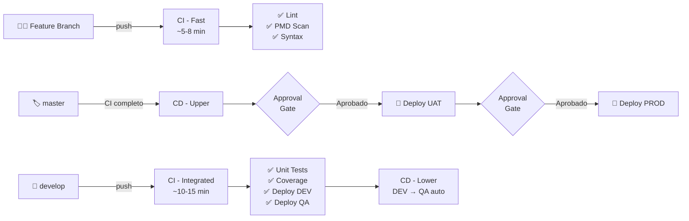

<div align="center">

# ⚡ Salesforce CI/CD — Azure DevOps Enterprise Pipeline

[](https://developer.salesforce.com)
[](https://dev.azure.com)
[](https://nodejs.org)
[](https://www.gnu.org/software/bash/)
[](https://git-scm.com)
[](LICENSE)

<br/>

> **Sistema enterprise de CI/CD para proyectos Salesforce sobre Azure DevOps.**
> Arquitectura multi-pipeline · JWT Auth · Delta Deployment · 18 templates YAML reutilizables

<br/>


</div>

---

## 🗺️ Arquitectura del sistema



---

## 🚀 Pipelines

| Archivo | Propósito | Trigger | Duración |
|---------|-----------|---------|----------|
| `azure-pipelines-ci.yml` | CI rápido — validación temprana | `feature/*` · `hotfix/*` | ~5–8 min |
| `azure-pipelines-ci-integrated.yml` | CI completo — integración y calidad | `develop` | ~10–15 min |
| `azure-pipelines-cd-lower.yml` | Despliegue automático DEV → QA | Completado CI-Integrated | ~6–8 min |
| `azure-pipelines-cd.yml` | Despliegue controlado UAT → PROD | Completado CI en master | ~6–10 min + aprobación |

---

## 📦 Sistema de Templates YAML

> El corazón del sistema. Cada pipeline se construye ensamblando templates atómicos reutilizables.

<details>
<summary><b>🔧 templates/steps/ — 18 steps atómicos</b></summary>

| Template | Descripción |
|----------|-------------|
| `salesforce-jwt-auth.yml` | Autenticación segura con JWT Bearer Token |
| `pmd-scanner.yml` | Análisis estático de código Apex con PMD |
| `eslint-validation.yml` | Linting de JavaScript / LWC |
| `code-coverage-check.yml` | Validación de cobertura mínima (≥75%) |
| `apex-compilation-check.yml` | Compilación Apex sin despliegue |
| `metadata-diff-check.yml` | Detección de cambios en metadata |
| `metadata-syntax-validator.yml` | Validación de sintaxis XML |
| `tools-installation.yml` | Instalación de SF CLI + Node.js |
| `environment-validation.yml` | Verificación de variables de entorno |
| `org-connection-validation.yml` | Test de conectividad con la org |
| `workspace-preparation.yml` | Configuración de Git y directorios |
| + 7 más | `agent-connectivity`, `build-summary`, `setup-summary`... |

</details>

<details>
<summary><b>🚢 templates/deployment/ — Delta & Rollback</b></summary>

| Template | Descripción |
|----------|-------------|
| `delta-deployment.yml` | Solo despliega componentes modificados |
| `deployment-validation.yml` | Validación pre-despliegue |
| `impact-analysis.yml` | Análisis de impacto de cambios |
| `rollback-planning.yml` | Planificación de rollback automático |

</details>

<details>
<summary><b>🏆 templates/quality/ — Quality Gates</b></summary>

| Template | Descripción |
|----------|-------------|
| `gate-evaluator.yml` | Evaluador central de calidad — falla el build si no pasa |
| `metrics-calculator.yml` | Cálculo de métricas de calidad |
| `quality-report-generator.yml` | Generación de reporte de calidad |
| `junit-report-generator.yml` | Publicación de resultados de tests |
| `artifact-packager.yml` | Empaquetado y publicación de artefactos |

</details>

---

## 🔐 Autenticación JWT — Sin contraseñas en el pipeline

```
┌─────────────────────┐      ┌──────────────────────┐
│  Salesforce Org     │      │   Azure DevOps        │
│                     │      │                       │
│  Connected App  ────┼──────┼──► Variable Group     │
│  + Certificado .crt │      │    (Consumer Key)     │
│                     │      │                       │
│                     │      │  ► Secure File        │
│                     │      │    (server.key)       │
└─────────────────────┘      └──────────┬───────────┘
                                         │
                              ┌──────────▼───────────┐
                              │  Pipeline Agent       │
                              │                       │
                              │  sf org login jwt     │
                              │    --client-id ...    │
                              │    --jwt-key-file ... │
                              └──────────────────────┘
```

> Ver [`credentials/README.md`](credentials/README.md) para configurar el Variable Group.
> Ver [`bin/README.md`](bin/README.md) para generar el par de claves con OpenSSL.

---

## ⚡ Delta Deployment — Solo lo que cambió

El script `scripts/generate-delta-package.sh` compara dos commits y genera automáticamente un `package.xml` con **solo los componentes modificados**, reduciendo tiempo de despliegue y riesgo de errores.

```bash
# Genera package.xml con cambios entre origin/main y HEAD
bash scripts/generate-delta-package.sh origin/main HEAD manifest/package.xml
```

```yaml
# En el pipeline — automático via template
- template: templates/deployment/delta-deployment.yml
  parameters:
    targetOrg: 'persistent-qa'
    baseCommit: 'origin/develop'
    testLevel: 'RunLocalTests'
```

**Soporta:** `ApexClass` · `ApexTrigger` · `LightningComponentBundle` · `AuraDefinitionBundle` · `ApexPage` · `ApexComponent`

---

## ✅ Quality Gates automáticos

| Check | Herramienta | Threshold |
|-------|-------------|-----------|
| 🔍 Análisis estático Apex | PMD Scanner | 0 violaciones críticas |
| 🎨 Linting JS / LWC | ESLint + Prettier | 0 errores |
| 🧪 Cobertura de tests | Salesforce Apex | ≥ 75% |
| ⚙️ Compilación | SF CLI | Sin errores |
| 📄 Sintaxis metadata | SF CLI | XML válido |

---

## 🛠️ Configuración rápida

### Prerrequisitos

```bash
# Instalar Salesforce CLI
npm install -g @salesforce/cli

# Instalar dependencias del proyecto
npm install
```

### Generar claves JWT

```bash
# Clave privada
openssl genrsa -out bin/server.key 2048

# Certificado autofirmado (2 años)
openssl req -new -x509 -key bin/server.key \
  -out bin/server.crt -days 730 \
  -subj "/C=CO/ST=Colombia/O=TuEmpresa/CN=salesforce-cicd"
```

### Autenticar con DevHub y crear scratch org

```bash
sf org login web --alias DevHub --set-default-dev-hub
sf org create scratch \
  --definition-file config/project-scratch-def.json \
  --alias dev-local --duration-days 30
sf project deploy start --target-org dev-local
```

---

## 📁 Estructura del proyecto

```
salesforce-cicd-azure-devops/
│
├── 📋 azure-pipelines-ci.yml            ← CI rápido (feature/*)
├── 📋 azure-pipelines-ci-integrated.yml ← CI completo (develop)
├── 📋 azure-pipelines-cd-lower.yml      ← CD automático DEV → QA
├── 📋 azure-pipelines-cd.yml            ← CD con approval UAT → PROD
│
├── 📦 templates/
│   ├── steps/          (18 steps atómicos)
│   ├── deployment/     (delta, validation, rollback)
│   ├── quality/        (gates, metrics, reports)
│   ├── testing/        (unit, security, performance)
│   └── cd/             (jobs de despliegue)
│
├── 🔬 force-app/main/default/
│   ├── classes/        (AccountService + Tests)
│   └── triggers/       (AccountAutomationTrigger)
│
├── 🛠️ scripts/
│   ├── generate-delta-package.sh
│   ├── setup-persistent-environments.sh
│   └── check-expiration.sh
│
├── ⚙️ .azure/           (environments, validation matrix)
├── 🔑 credentials/      (README + template — sin valores reales)
└── 🗝️ bin/              (README + instrucciones server.key)
```

---

## 🌍 Ambientes

| Ambiente | Tipo | Propósito | Despliegue |
|----------|------|-----------|-----------|
| **DEV** | Scratch Org | Desarrollo de features | Automático desde `develop` |
| **QA** | Scratch Org persistente | Testing de integración | Automático post-CI |
| **UAT** | Sandbox | Validación con stakeholders | Manual con approval gate |
| **PROD** | Producción | Entrega final | Manual con approval gate |

---

<div align="center">

## 👨‍💻 Autor

**Oscar López** — DevOps Engineer

[](https://github.com/xaviicode)
[](https://linkedin.com/in/)
[](https://github.com/xaviicode)

<br/>

*2 años de experiencia DevOps · Azure DevOps · Salesforce · .NET · Git*

*¿Necesitas configurar CI/CD para tu proyecto Salesforce o Azure? → [Contáctame](https://github.com/xaviicode)*

<br/>


</div>
